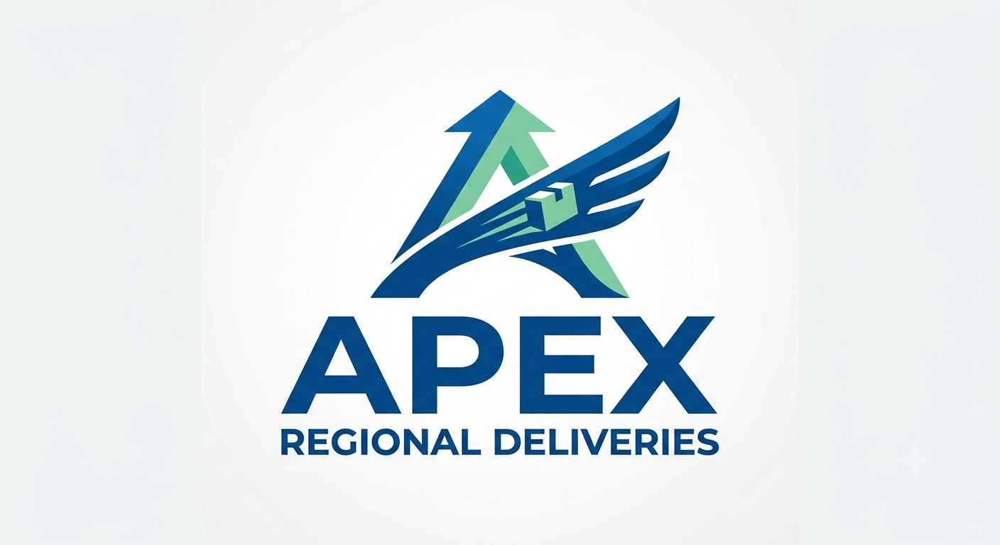
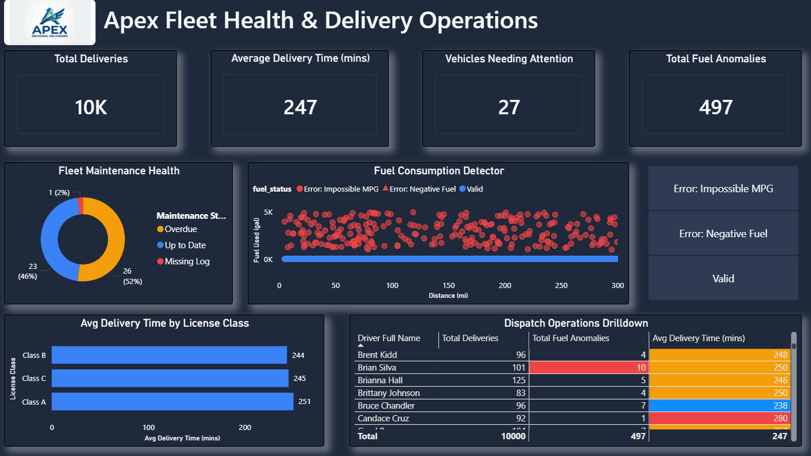

# Apex Fleet Health & Routing Operations: End to End Data Pipeline


## Table of Contents
- [Project Overview](#project-overview)
- [Key Metrics Tracked (KPIs)](#key-metrics-tracked-kpis)
- [Executive Dashboard](#executive-dashboard)
- [Methodology & Tech Stack](#methodology--tech-stacks)
- [Strategic Reccommendations](#strategic-recommendations)
- [Repository Structure](#repository-structure)
- [Next Steps](#next-steps)

---

## Project Overview
**Apex Regional Deliveries** is a fictional logistics company facing operational bottlenecks. Dispatchers were struggling to identify underperforming drivers, and the VP of Finance suspected major data quality issues regarding reported fuel consumption and vehicle maintenance.

**The Business Problem:** Unreliable raw data and missing maintenance logs were leading to unexpected vehicle breakdowns and untracable fuel cost.

This Project is an **End-to-End Data Analysis and BI Pipeline** designed to solve these business problems. I built a custom ETL workflow that generates raw logistics data of over 10,000 data points, cleansed and modeled it in a relational database, and transitioned it to an interactive, executive-ready Power BI dashboard.

> **View the full formal Business Requirments Document (BRD) [here](Business_Requirements.md)**

---

## Key Metrics Tracked (KPIs)
To solve the operational bottlenecks, the pipeline and dashboard were designed to track the following metrics:
* **Driver Efficiency:** Average time elapsed between dispatch and completion.
* **Fuel Consumption Anomalies:** Count of records where fuel usage exceeds tank capacity or falls below 0.
* **Compliance Status:** Percentage of fleet overdue or missing maintenance logs.

---

## Executive Dashboard




---

## Methodology & Tech Stacks

This project follows a ETL/ELT workflow:

1. **Data Generation (Python):** - Utilized `Faker` and `pandas` to generate over 10,000 rows of realistic logistics data across three tables: `Drivers`, `Vehicles`, and `Delivery Routes`.
   - *Data Quality Engineering:* Intentionally injected real-world anomalies (e.g., negative fuel entries, missing maintenance logs, and mathematically impossible MPG rates) to simulate a messy production environment.
2. **Data Management (PostgreSQL & DBeaver):** - Loaded the raw CSVs into a structured PostgreSQL database using custom schemas (`apex-fleet-data-pipeline`).
3. **Data Transformation (SQL):** - Wrote SQL scripts utilizing Common Table Expressions (CTEs), `EXTRACT(EPOCH)`, `COALESCE`, and `CASE` statements to clean the data.
   - Created optimized, analytical `VIEWS` that flagged anomalies in the database before passing them in the BI sector.
4. **Data Visualization (Power BI):** - Designed a Star Schema data model.
   - Created custom DAX measures for informative KPIs.
   - Built an interactive, UI/UX-optimized featuring custom Tile Slicers and Exception Reporting matrixes.

---

## Dashboard Features and Key Business Insights
By interacting with our dashboard, the VP of Finance and Dispatch Manager can uncover several critical operational bottlenecks
- **Fuel Consumption Detector:** Built an interactive scatter plot with a custom Tile Slicer, allowing the VP of Finance to instantly filter out valid trips and auto-zoom into mathematically impossible fuel records (e.g., negative gallons or 5,000+ gallon outliers). The number of fuel anomalies can also be drilled down by license class in **Avg Delivery Time by License Class** and by driver in **Dispatch Operations Drilldown**.
  - **Business Insight:** The anomaly detection scatter plot revealed mathematically impossible fuel entries. Indicating the severe issue with either the vehicle telemetry sensors or manual driver data entry that requires immediate auditing.


- **Dispatch Operations Drilldown:** Developed a conditional formatting matrix that automatically highlights drivers averaging over 265 minutes per route in red, while rewarding highly efficient drivers averaging below 240 minutes in blue, and those highlighted in yellow sitting between each threshold. The matrix also gives a detailed look into which drivers are creating unnecessary fuel log mistakes, highlighting those in red with 8 or more log errors. This allows management to shift from "guessing" who is underperforming to implementing targeted retraining.
   - **Business Insight:** The matrix shows at least 8 drivers struggle to meet the average delivery goal, with 4 others right on the line of failing to meet the threshold.
- **Fleet Maintenance Health:** Identified critical fleet risks by isolating vehicles currently operating with "Missing Logs" or "Overdue" maintenance status. The donut chart immediately flags vehicles operating "Missing Logs", allowing dispatchers to ground non-compliant vehicles before they result in DOT fines or breakdowns.
   - **Business Insight:** Over half of the fleet are either overdue for a service (*52%*) or missing a maintenance log (*2%*). 

---

## Strategic Recommendations
* **Fuel Logs:** Initiate an immediate hardware audit on the vehicles flagged with 5,000+ gallon anomalies to determine if the issue is a faulty telemetry sensor or a software logging error. If neither bugs are found, a training session for employees struggling with manual fuel logging is recommended.
*  **Prolonged Delivery Services:** While the Operations Drilldown give the managers the ability to find slower drivers. Re-training would be a key tool to help boost those drivers that are struggling to maintain a swift delivery time below 265 minutes. Pairing these drivers with employees that maintain a low average delivery time would give a chance to show drivers possible bottlenecks they take when delivering. If needed, a 1-on-1 efficiency training should be scheduled for underperforming drivers quarterly or yearly.
*  **Maintenance Logs:** Over half of the company's fleet is underperforming in fleet maintenance logs. Maintenance should go through these logs to determine if any have been mislabeled. The vehicles that remain as "Overdue" should be pulled from routes at a proper time to receive their maintenance to comply with DOT regulations and ensure a safe working environment for our employees.

---

## Repository Structure
```text
Apex-Fleet-Data-Pipeline/
│
├── Power_BI/
│   ├── Fleet_Health_Dashboard.Report/       # PBIP Report definition
│   ├── Fleet_Health_Dashboard.SemanticModel/# PBIP Data model
│   ├── Fleet_Health_Dashboard.pbip          # Power BI Project file
│   └── Fleet_Health_Dashboard.pbix          # Standard Power BI file
├── assets/
|   ├── APEX_logo.png                        # Company logo
|   ├── fleet_health_dashboard.png    # APEX Fleet Health & Delivery Operations screenshot
|   ├── fuel_consumption.gif                 # Slicer example 
├── data/
│   ├── delivery_routes_raw.csv              # Generated routes dataset
│   ├── drivers_raw.csv                      # Generated drivers dataset
│   └── vehicles_raw.csv                     # Generated vehicles dataset
│
├── py_scripts/
│   ├── 01_data_generator.ipynb              # Jupyter Notebook for exploration
│   └── 01_data_generator.py                 # Executable Python script
│
├── sql_scripts/
│   ├── 02_create_raw_tables.sql             # DDL for Postgres tables
│   └── 03_clean_and_transform.sql           # CTEs and Views for cleaning
│
└── README.md
```

---

## Next Steps
While the initial pipeline successfully identified core operational bottlenecks, I plan to expand this project in the following ways:
* **Efficiency Training:** Reanalyze employees after training, to detemrine if training has improved averages.
* **Row-Level Security in Power BI:** Implement RLS within the dashboard so regional dispatch managers can log in and securely view only their drivers and fleet to their assigned operating territories for less data clutter and faster response time.
* **Route Mapping:** Integrate a mapping API like Google Maps into the data generation script to map actual latitude/longitude coordinates, allowing for visual bottleneck analysis of specific traffic routes in Power BI.
* **Cloud Migration & Data Automation:** Transition the local PostgreSQL database to a cloud environment like Google Cloud SQL and automate the Python data generation script to update incoming data on a weekly or monthly schedule.
* **Dashboard Drilldown:** Split these three factors into their own page or dashboard for more precise drilldown on specific needs from different departments.

