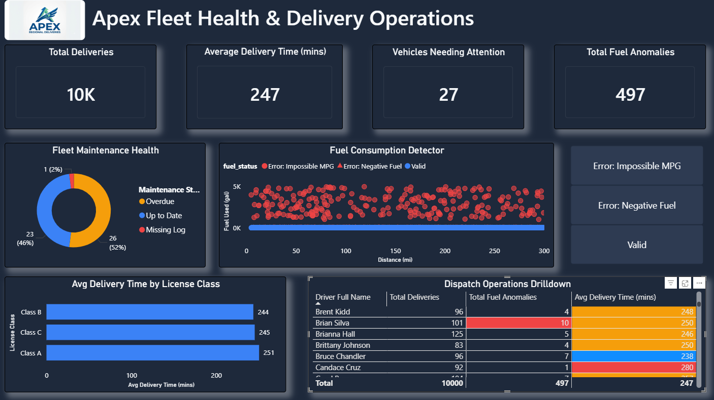

# Apex Fleet Health & Routing Operations: End to End Data Pipeline


## Project Overview
**Apex Regional Deliveries** is a fictional logistics company facing operational bottlenecks. Dispatchers were struggling to identify underperforming drivers, and the VP of Finance suspected major data quality issues regarding reported fuel consumption and vehicle maintenance.

This Project is an **End-to-End Data Analysis and BI Pipeline** designed to solve these business problems. I built a custom ETL workflow that generates raw logistics data, cleanses and models it in a relational database, and serves it to an interactive , executive-ready Power BI dashboard.




---

## Architecure & Tech Stack

This project follows a modern ETL/ELT workflow:

1. **Data Generation (Python):** - Utilized `Faker` and `pandas` to genrate over 10,000 rows of realistic logistics data across three tables: `Drivers`, `Vehicles`, and `Delivery Routes`.
   - *Data Quality Engineering:* Intentionally injected real-world anomalies (e.g., nagative fuel entries, missing maintenance logs, and mathematically impossible MPG rates) to simulate a messy production enviroment.
2. **Data Managemnet (PostgreSQL & DBeaver):** - Loaded the raw CSVs into a structured PostgreSQL database using custom schemas (`apex-fleet-data-pipeline`).
3. **Data Transformation (SQL):** - Wrote advanced SQL scripts utilizing Common Table Expressions (CTEs), `EXTRACT(EPOCH)`, `COALESCE`, and `CASE` statements to clean the data.
   - Created optimized, analytical `VIEWS` that flagged anomalies natively in the database before passing them in the BI layer.
4. **Data Visualization (Power BI):** - Designed a Star Schema data model.
   - Created custom DAX measures for informative KPIs.
   - Built an interactive, UI/UX-optimized featuring custom Tile Slicers and Exception Reporting matixes.

---

## Dashboard Feartures and Key Business Insights
By interracting with our dahsboard, the VP of finance and Dispatch Manager can uncover several critical operational bottlenecks
- **Fuel Consumption Detector:** Built an interactive scatter plot with a custom Tile Slicer, allovwing the VP of Finance to isntantly filter out valid trips and auto-zoom into mathematically impossible fuel recors (e.g., negative gallons or 5,000+ gallon outliers). The number of fuel anomolies can also be drilled down by license class in **Avg Delivery Time by License Class** and by driver in **Dispatch Operations Drilldown**. The anomaly detection scatter plot revealed mathematically impossible fuel entries. Indicating ta servere issue with iether the vehicle telemetry sensors or manual driver data entry that requires immediate auditing.


- **Dispatch Operations Drilldown:** Developed a conditional formatting matrix that automatically highlights drivers averaging over 265 minutes per route in red, while rewarding highly efficient drivers averaging below 240 minutes in blue, and those highlighted in yellow sitting between each thresholds. The matrix also gives a detailed look into which drivers are creating unnecessary fuel log mistakes, highlighting those in red with 8 or more log errors. This allows managment to shift from "guessing" who is underperforming to implementing targeted retrainning.
- **Fleet Maintenance Health:** Identified critical fleet risks by isolating vehicles currently operating with "Missing Logs" or "Overdue" maintenance status. The donut chart immediatly flags vehicles operating "Missing Logs", allowing dispatchers to ground non-compliant vehicles before they result in DOT fines or breakdowns.

---

## Strategic Recommendations
* **Fuel Logs:**: It is advised that all affected truck's, with outstanding fuel consumptions, telementry systems be checked instantly or during the next maintence service to find the possible bug that is causing this missrepresentation of fuel logs. If no bug is found, by drilling down to our matrix, managers can find employees with high miss-reported fuel logs to go over the importance and training of fuel logging.
*  **Prolonged Delivery Services:** While the Operations Drilldown give the managers the ability to find slower drivers. Re-training would be a key tool to help boost those drivers that are struggling to maintian a swift delivery time. Pairing these drivers with those that maintian a low average delivery time, would give a chance to show drivers possible bottleneck they take when delivering and work-around to completing their daily goals.
*  **Maintence Logs:** Over half of the companies fleet is underperforming in fleet maintenance logs. While only one is labeled "Missing". Could that mean serval "Overdue" logs are just missing? It would be advised that the head of maintence go through these logs to determine if any logs have been miss-labeled. The vehicles that still maintain "Overdue" labels should be pulled from routes at a proper time to recieve their maintenance to comply with DOT regualtions and a safe working enviroment for our employees.

## Repository Structure
## 📁 Repository Structure
```text
Apex-Fleet-Data-Pipeline/
│
├── Power_BI/
│   ├── Fleet_Health_Dashboard.Report/       # PBIP Report definition
│   ├── Fleet_Health_Dashboard.SemanticModel/# PBIP Data model
│   ├── Fleet_Health_Dashboard.pbip          # Power BI Project file
│   └── Fleet_Health_Dashboard.pbix          # Standard Power BI file
├── assets/
|   ├── APEX_logo.png                        # Company logo
|   ├── fleet_health_dashboard_screenshot    # APEX Fleet Health & Delivery Operations screenshot
|   ├── fuel_consumption.gif                 # Slicer example 
├── data/
│   ├── delivery_routes_raw.csv              # Generated routes dataset
│   ├── drivers_raw.csv                      # Generated drivers dataset
│   └── vehicles_raw.csv                     # Generated vehicles dataset
│
├── py_scripts/
│   ├── 01_data_generator.ipynb              # Jupyter Notebook for exploration
│   └── 01_data_generator.py                 # Executable Python script
│
├── sql_scripts/
│   ├── 02_create_raw_tables.sql             # DDL for Postgres tables
│   └── 03_clean_and_transform.sql           # CTEs and Views for cleaning
│
└── README.md
